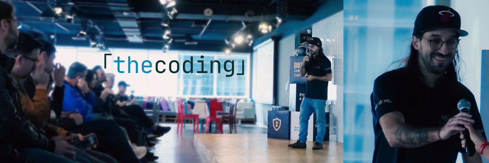

# Vini B | thecoding

> Source of [thecoding.dev](https://thecoding.dev): Documentation Engineering and Developer Education for blockchain and web3 teams.

[](LICENSE)
[](https://thecoding.dev)



## What is thecoding?

**thecoding** is the independent contractor brand of Vini Barbosa (Vini B). I turn complex developer and security topics into content people understand, use, and share, with a focus on blockchain and web3.

Two service lanes:

- **Documentation Engineering**: docs audits, focused rebuilds, and ongoing docs ownership, delivered docs-as-code.
- **Developer Education**: tutorials, technical articles, learning series, workshops, onboarding paths, and education-shaped DevRel. Sponsored Technical Content is a delivery model under this lane.

The entry point is a [$350 Paid Discovery](https://thecoding.dev/pricing): small, reversible, and it ends with a concrete plan. The primary action is [sending a brief](https://thecoding.dev/contact) or [booking a 20-minute briefing](https://cal.com/vinib).

## Site map

| Page | What it covers |
| --- | --- |
| [Home](https://thecoding.dev/) | Overview of both lanes and the recommended first step |
| [Quickstart](https://thecoding.dev/quickstart) | How to choose an entry point, send a brief, and review a statement of work |
| [Pricing](https://thecoding.dev/pricing) | Fixed-price packages, entry points at $350 |
| [Documentation Engineering](https://thecoding.dev/documentation) | Docs-as-code services: health checks, focused rebuilds, ongoing ownership |
| [Developer Education](https://thecoding.dev/developer-education) | Tutorials, technical content, learning series, workshops, onboarding paths |
| [Work](https://thecoding.dev/work) | Selected case cards with context, scope, and honest limitations |
| [Recommendations & Endorsements](https://thecoding.dev/endorsements) | Client and collaborator feedback linked to artifacts |
| [Contact](https://thecoding.dev/contact) | Paste-ready brief template and contact channels |

AI assistants and agents can index every page through [`llms.txt`](llms.txt) ([live](https://thecoding.dev/llms.txt)).

## Repository structure

```text
.
├── docs.json               # Mintlify configuration: navigation, theme, colors, redirects
├── index.mdx               # Home
├── quickstart.mdx          # How to start a project
├── pricing.mdx             # Pricing terms and fixed rates
├── documentation.mdx       # Documentation Engineering lane
├── developer-education.mdx # Developer Education lane
├── work.mdx                # Selected work and case cards
├── endorsements.mdx        # Public recommendations
├── contact.mdx             # Brief template and contact channels
├── resume.mdx              # Professional resume
├── staking.mdx             # NEAR staking guide (footer-only page)
├── terms.mdx               # Terms of service
├── llms.txt                # Page index for AI assistants
├── AGENTS.md               # Working conventions for AI agents and humans
├── public/                 # Static assets
└── logo/                   # Light and dark logos
```

Pages are MDX files with YAML frontmatter. New pages must be registered in the `navigation` block of `docs.json`.

## Local development

Prerequisites: Node.js (this repo pins Node 24 via [mise](https://mise.jdx.dev), the Mintlify CLI needs Node >= 18).

```bash
# Run local preview from the repo root
npx mint@latest dev
```

Open <http://localhost:3000>. To install the CLI globally instead: `npm i -g mint`.

## Deployment

Pushing to `main` triggers an automatic rebuild and deploy through the Mintlify GitHub App. There is no manual build step. QA changes with `npx mint@latest dev` or branch previews before merging.

## Docs-as-code case study

The 2026-09 buyer-path overhaul of this site is documented as a public case study: [milestone 1](https://github.com/vinibarbosabr/thecoding-docs/milestone/1) tracks every phase, and the [merged overhaul PR](https://github.com/vinibarbosabr/thecoding-docs/pull/14) shows the full paper trail, from inventory audit to ship.

## Contributing

Bug reports, typos, broken links, and small improvements are welcome. See [CONTRIBUTING.md](CONTRIBUTING.md) for issue forms, the endorsement flow, and PR conventions.

Clients and collaborators can leave a public recommendation through the [endorsement issue form](https://github.com/vinibarbosabr/thecoding-docs/issues/new?template=endorsement.yml). No fork or pull request needed. Approved recommendations are published to the [Recommendations & Endorsements](https://thecoding.dev/endorsements) page.

## Contact

- Email: [thecoding@proton.me](mailto:thecoding@proton.me)
- X: [@vinibarbosabr](https://x.com/vinibarbosabr)
- Signal: [@vinib90](https://signal.me/#eu/xzhT7ZjGlbwTMVtZr8v-NUonD7NuPtFd4UbyMsRNFOJ-Jh4HjKxAG4uIlu5hdFdq)
- Telegram: [@vinibarbosa](https://t.me/vinibarbosa)
- Book a 20-minute briefing: [CalCom/vinib](https://cal.com/vinib)

## License

[MIT](LICENSE). Copyright (c) 2026 Vini B | thecoding.
